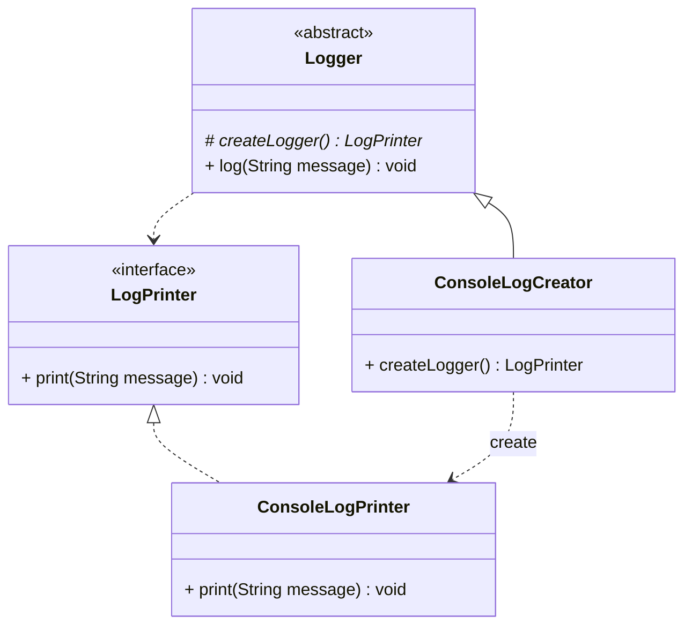

# Design Patterns

# Desafio 1 - Factory Method

## Diagrama

```mermaid
classDiagram
    class Logger {
        <<abstract>>
        # createLogger()* LogPrinter
        + log(String message) void
    }

    class LogPrinter {
        <<interface>>
        + print(String message) void
    }

    class ConsoleLogCreator {
        + createLogger() LogPrinter
    }

    class ConsoleLogPrinter {
        + print(String message) void
    }

    Logger <|-- ConsoleLogCreator
    LogPrinter <|.. ConsoleLogPrinter
    Logger ..> LogPrinter
    ConsoleLogCreator ..> ConsoleLogPrinter : create

```
